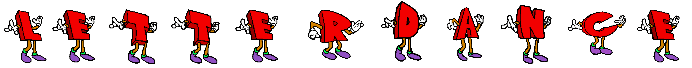

# Letter Dance Animation



The `LetterDance` class allows you to create a dance animation by combining letter GIFs horizontally. Each letter in the animation is represented by a GIF file.

### Example Usage

```python
from PIL import Image
import imageio
import os

class LetterDance:
    # ... (class code here) ...

def main():
    letter_dance = LetterDance("letterdance", "letterdance.gif")
    letter_dance.dance(2)

if __name__ == "__main__":
    main()
```

In this example, we create an instance of the `LetterDance` class with the letters "letterdance" and specify the output filename as "letterdance.gif". Then we call the `dance()` method on the instance, passing a `scale_factor` of 2. This will scale the letters in the animation by a factor of 2.

The resulting dance animation is saved as "letterdance.gif".

To run the example, you need to have the following:

1. The `Pillow` and `imageio` libraries installed. You can install them using `pip install pillow imageio`.

When you run the example, it will generate the dance animation by combining the GIFs for each letter horizontally, applying the specified scaling factor. The resulting animation will be saved as "letterdance.gif".

The `LetterDance` class provides methods to retrieve information about the GIF files, such as frame count, duration, and dimensions. It also handles the process of combining the frames and saving the animation.

## Contributing

Pull requests are welcome! If you'd like to contribute to this project, you can fork the repository, make your changes, and submit a pull request. Please ensure that your code adheres to the existing style, uses semantic commit messages and works as expected.

## Issues

If you encounter any issues or have suggestions for improvements, you can open an issue in the repository. While I can't guarantee that all issues will be addressed, they will be looked at and considered.

## License

This project is licensed under the [MIT License](LICENSE). Feel free to use, modify, and distribute the code.
